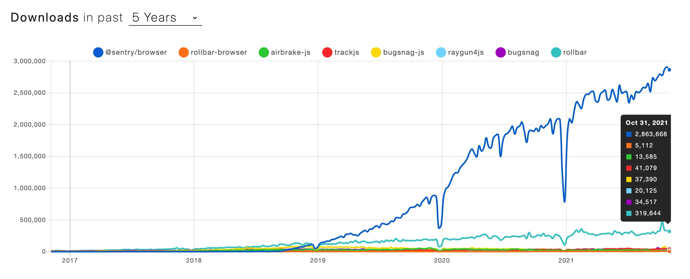
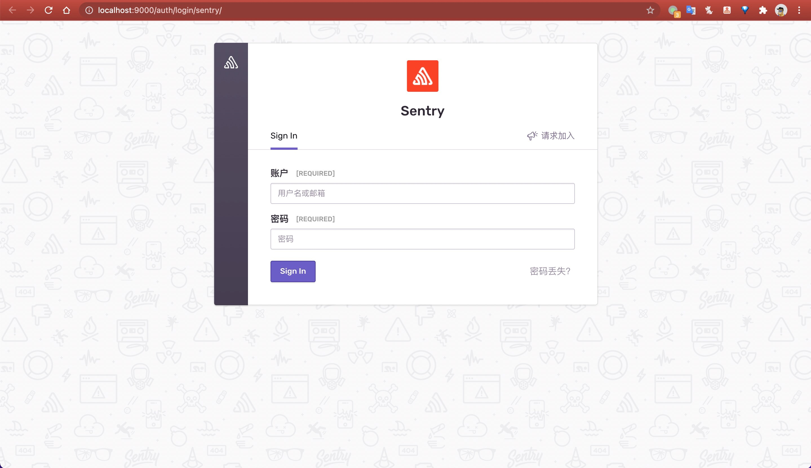
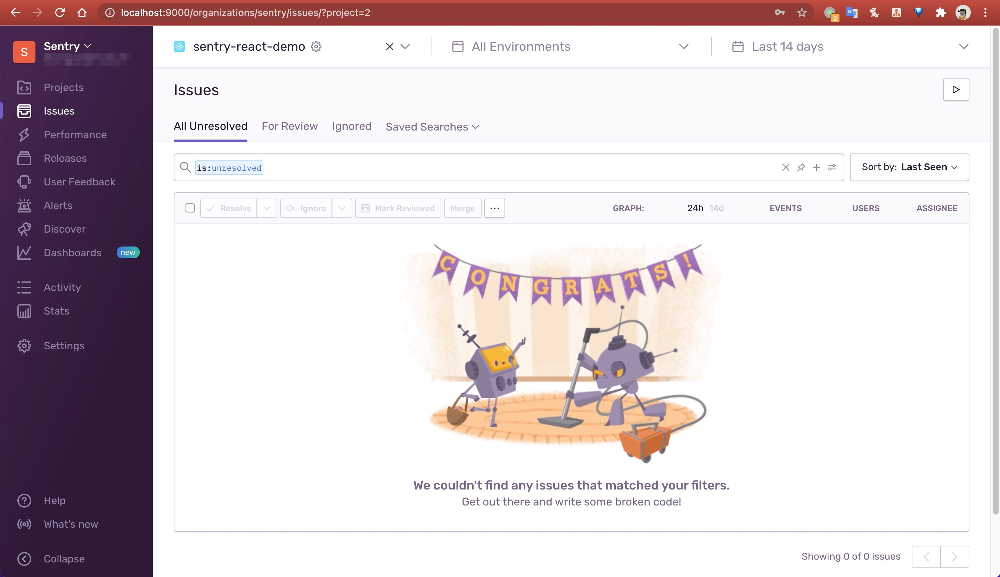
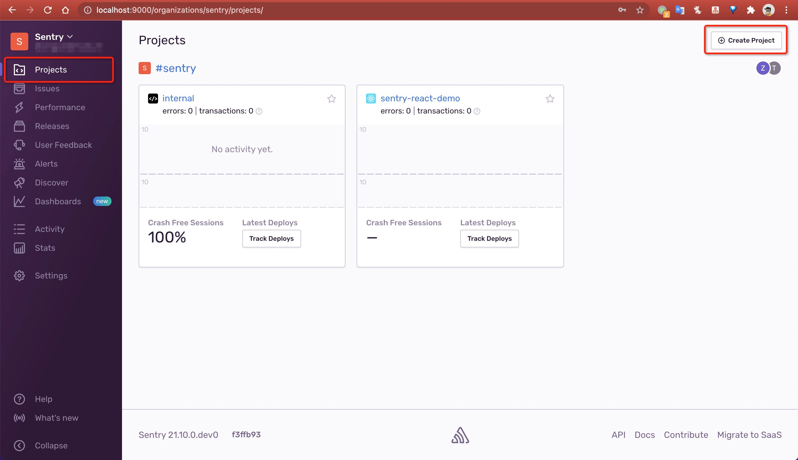
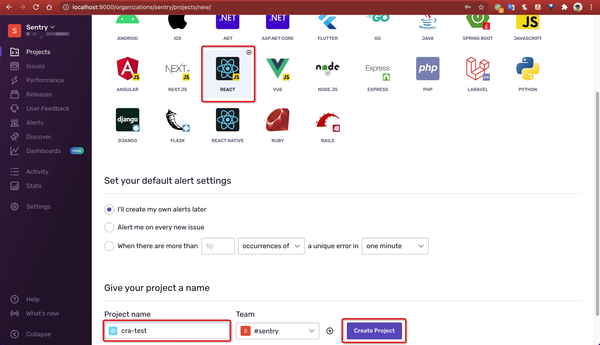
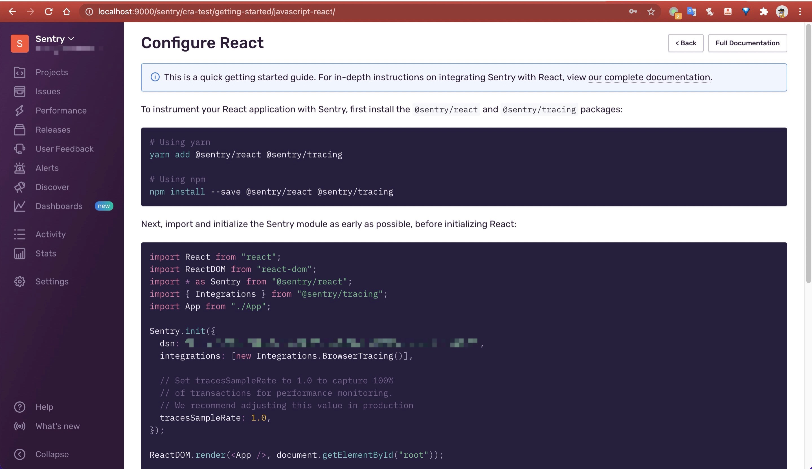
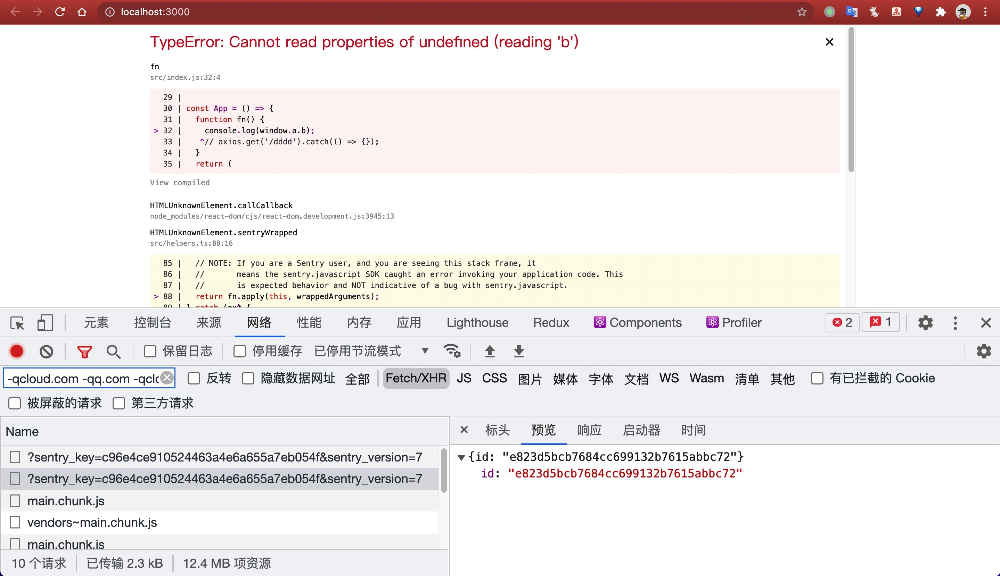
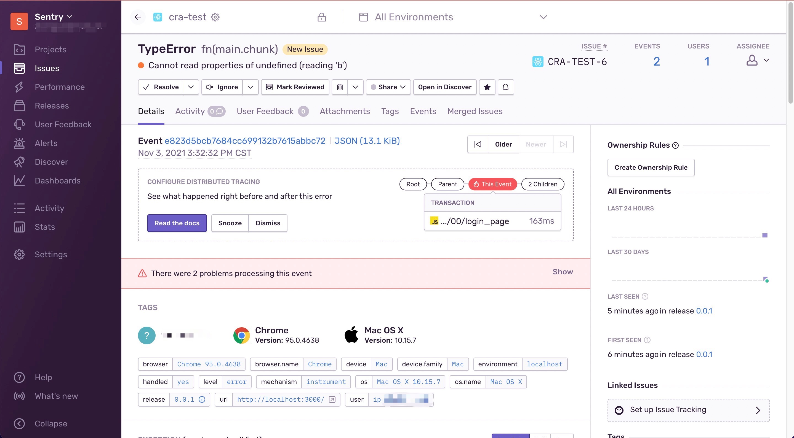

# Sentry 实战

## Sentry 简介

[Sentry](https://sentry.io/) 是一套开源的实时异常收集、追踪、监控系统，可以为开发者的提供帮助、诊断，修复和优化其代码的性能的能力，可以用它来监控线上服务的健康状态，实时收集的异常堆栈信息可以帮助我们快速发现、定位和修复问题。这套解决方案由对应各种语言的 `SDK` 和一套庞大的数据后台服务组成。通过 `SDK` 在客户端把异常数据、性能指标等信息上报到数据服务之后，会通过过滤、关键信息提取、归纳展示在管理后台的界面中。然后我们可以在管理后台界面中实时查看应用的异常状态。`Sentry` 还可以第一时间将报错的信息：页面路由、异常文件、请求方式等一些非常详细的信息以消息或者邮件的方式通知我们。

`Sentry` 提供付费的 [SaaS版本](https://sentry.io/pricing/)，另外也提供了开源的[私有化部署版本](https://develop.sentry.dev/self-hosted/)。

## 为什么选择 `Sentry` ?

在市场上有许多供应商提供类似的一体化解决方案，国外有 [BugSnag](https://www.bugsnag.com/)、 [RollBar](https://rollbar.com/)，国内有 [oneapm](https://www.oneapm.com/)、[fundebug](https://www.fundebug.com/)、[神策](https://www.sensorsdata.cn/)等，那为什么我们偏偏选择 `Sentry` 呢？

因为 `Sentry` 是 100% [开源](https://open.sentry.io/)的，我们可以使用它的 `SaaS` 版的，除此之外我们也可以私有化部署。

另外 `Sentry` 支持主流的编程语言，可以通过 [这里](https://docs.sentry.io/platforms/) 查看所有支持的语言。

通过下面这张图可以看出，`Sentry` 在前端的近两年[发展趋势](https://www.npmtrends.com/@sentry/browser-vs-rollbar-browser-vs-airbrake-js-vs-trackjs-vs-bugsnag-js-vs-raygun4js-vs-bugsnag-vs-rollbar)，以及与其它竞争者对比：



## 一、下载 `sentry docker` 仓库并部署

`Sentry` 的管理后台是基于 `Python Django` 开发的。这个管理后台由背后的 `Postgres` 数据库（管理后台默认的数据库）、`ClickHouse`（存数据特征的数据库）、`relay`、`kafka`、`redis` 等一些基础服务或由 `Sentry` 官方维护的总共 `23` 个服务支撑运行。如果独立的部署和维护这 `23` 个服务将是异常复杂和困难的。幸运的是，官方提供了基于 `docker` 镜像的一键部署实现: `getsentry/onpremise`。

### 1. 下载

  ```bash
  git clone https://github.com/getsentry/onpremise
  ```

### 2. 安装

- 进入目录

  ```bash
  cd onpremise
  ```

- `mac` 如果执行 `./install.sh` 报错

  ```bash
  ./install/_lib.sh: line 15: realpath: command not found
  ```

- 在这里找到解决方案: <https://github.com/getsentry/onpremise/issues/941>

  ```bash
  brew install coreutils
  ```

- 重新执行`./install.sh`，如果报docker内存分配不够

  ```bash
  ▶ Parsing command line ...

  ▶ Setting up error handling ...

  ▶ Checking minimum requirements ...
  FAIL: Required minimum RAM available to Docker is 3800 MB, found 1985 MB
  ```

- docker内存配大点，否则无法安装

  `Docker` -> `Preferences` -> `Resources` -> `Memory` 分配`4G`

- 重新执行`./install.sh`，成功

  ```bash
  -----------------------------------------------------------------

  You're all done! Run the following command to get Sentry running:

    docker-compose up -d

  -----------------------------------------------------------------
  ```

### 3. 启动

- 安装过程中会让我们创建 `sentry` 后台管理员账号，可以先跳过，后面再创建

- 在 `onpremise` 文件中中启动服务

  ```bash
  docker-compose up -d
  ```

- 浏览器访问 <http://localhost:9000/> ，进入 `sentry` 管理界面，需要账号密码登录，下面我们创建管理员账号

  

### 4. 注册

- 创建超级管理员账号

  ```bash
  docker-compose run --rm web createuser --superuser
  ```

  执行结果

  ```bash
  Creating sentry_onpremise_web_run ... done
  Updating certificates in /etc/ssl/certs...
  0 added, 0 removed; done.
  Running hooks in /etc/ca-certificates/update.d...
  done.
  03:02:46 [INFO] sentry.plugins.github: apps-not-configured
  * Unknown config option found: 'slack.legacy-app'
  Email: test@xxx.tv    
  Password: 
  Repeat for confirmation: 
  Added to organization: sentry
  User created: test@xxx.tv
  ```

- 如果还使用上述命令，还可以创建新的账号，但数据是共享的

- 覆盖原账号：如果想修改密码可以使用

  ```bash
  docker-compose run --rm web createuser --superuser --force-update
  ```

### 5. 登录

- 浏览器访问 <http://localhost:9000/> ，输入刚才创建的超级管理员账号密码，登录

  

### 6. 停服

- 在`onpremise`目录

  ```bash
  docker-compose down
  ```

- 如果再次启动，则数据会保留

## 二、创建前端项目并接入 `sentry sdk`

### 1. 创建 `sentry` 项目

- 登录到 `sentry` 管理平台后，`菜单栏Projects` -> `Create Project`

  

- `Choose a platform` 中选择 `REACT`

- `Project Name` 改为 `cra-test`，点击创建

  

- 创建后会进入一个 `Configure React` 页，指引前端项目如何接入 `sentry sdk`

  

### 2. 前端接入 `sentry sdk`

- 创建一个前端项目

  ```bash
  npx create-react-app sentry-sdk-demo
  cd sentry-sdk-demo
  ```

- 安装 `SDK` 依赖

  ```bash
  # Using yarn
  yarn add @sentry/react @sentry/tracing

  # Using npm
  npm install --save @sentry/react @sentry/tracing
  ```

- 代码引入 `sdk`

  修改 `wordCloud.js`

  ```js
  import React from 'react';
  import ReactDOM from 'react-dom';
  import * as Sentry from '@sentry/react';
  import { Integrations } from '@sentry/tracing';
  import App from './App';

  Sentry.init({
    dsn: 'http://c96e4ce910524463a4e6a655a7ebxxxx@0.0.0.0:9000/3',
    environment: 'localhost',
    integrations: [new Integrations.BrowserTracing()],

    // Set tracesSampleRate to 1.0 to capture 100%
    // of transactions for performance monitoring.
    // We recommend adjusting this value in production
    tracesSampleRate: 1.0,
    release: '0.0.1',
  });

    ReactDOM.render(<App />, document.getElementById('root'));
  ```

- `Sentry.init` 参数说明

  - 官方文档: <https://docs.sentry.io/platforms/javascript/configuration/options/>

  - `dsn`

    - 前端通过sentry-sdk上报信息请求的目标地址，其实就是sentry后端地址，拿官方原话就是：`The DSN tells the SDK where to send the events to`

    - DSN可以安全地公开，因为它们只允许提交新事件和相关事件数据；它们不允许读取任何信息。 虽然存在滥用 DSN 的风险，其中任何用户都可以将事件连同他们想要的任何信息发送到你的组织，但这种情况很少发生。

    - 管理界面在 `Settings -> Projects -> Client Keys (DSN)`

    - 格式为 `{PROTOCOL}://{PUBLIC_KEY}:{SECRET_KEY}@{HOST}{PATH}/{PROJECT_ID}`

    - 例子:

      ```js
      'http://06b94ee717014df78b9b48c7f9f1xxxx@localhost:9000/2'
      ```

  - `environment`

    - 环境，这个定义是前端根据自己的开发、测试、预发布、线上环境等定义的，不配置的话默认为 `"production"`
    - 当错误上报后，`sentry` 管理界面的错误详情里会展示这个错误对应的 `environment`，并且在 `issues` 列表页中，会有一个 `environment` 筛选对应环境的错误
    - 其实目的是为了区分是哪个前端环境的错误

  - `integrations: [new Integrations.BrowserTracing()]`

    - BrowserTracing 集成为每个页面加载和导航事件创建一个新`Transaction`，并为每个 `XMLHttpRequest` 或在这些事务打开时发生的获取请求创建一个子`Span`，`Transaction`、`Span`相关术语后续会介绍。

  - `release`: 一般前端每次发布版本，都需要更新下 `release` 版本号，`sentry` 会根据 `release` 做分类，对应 `release` 下的信息，会体现在 `sentry` 管理界面菜单 `Releases` 中

### 3. 故意制造一个前端报错

  ```js
  function App() {
    function fn() {
      console.log(window.a.b);
    }
    return (
      <button onClick={fn}>Break the world</button>
    );
  }

  export default App;
  ```

- 点击 `Break the world` 按钮，可以看到控制台报错，并且发送了一个上报错误的请求到 `sentry`: `http://0.0.0.0:9000/api/3/store/?sentry_key=c96e4ce910524463a4e6a655a7ebxxxx&sentry_version=7`

  

### 4. `sentry` 管理界面查看错误详情

- 在菜单 `issues` 中，可以看到刚才上报的错误，点开可以查看详情：

  - `TAGS`: 包括请求IP、浏览器、操作系统等信息
  - `EXCEPTION`: 报错的类型、报错内容，错误堆栈信息等
  - `BREADCRUMBS`: 错误链路信息
  - 错误发生的页面地址及UA信息

  
